## typora笔记（结合源代码查看）

***


### 1.源代码查看快捷键ctrl + /

## 一，标题
### #一级标题
### ##二级标题

### 类推

***


## 二，字体

 1.**加粗、**

 2.*倾斜*

 3.***斜体加粗***

 4.~~删除线~~

5.<u>下划线</u>（建议使用快捷键ctrl+u）

6==高亮==

7.下标

H~2~     H~2~O       H~2~O~2~      CO~2~

8.上标 

m^2^     m^3^

***


## 三，表情(建议使用快捷键win+。)


:smile:       :cry:     😘    🤣     🤣    🤣     ❤️


***


## 四，表格(建议使用快捷键ctrl+t)

| name | price |
| ---- | ----- |
|      |       |
|      |       |
|      |       |
|      |       |
|      |       |
|      |       |


***


## 五，引用(可以镶嵌，还挺好用的)

> 一级引用
>
> 比较普通

> > 二级引用
> >
> > 也比较普通

> 要不来试试镶嵌吧
>
> > 愿你在我看不到的地方安然无恙
> >
> > > 来自歌词哟

> 晚安我的小绵羊宝贝
>
> > 来自她的晨、

***


## 六，列表（空格很重要）

### 1.无序列表(*+空格)

* 1.要好好上学，好好上课
* 2.要好好吃饭，照顾好自己

### 2.有序列表(1.+空格)

1. 吃饭
2. 睡觉
3. 打豆豆

***


## 七，代码(这个用来记c语言笔记再好不过了)

### 1.代码块(```+语言)

```c
#include <stdio.h>
int main()
{
    int num = 4;
    printf("num=%d\n",num);
    return 0;
}
```

### 2.行内代码(``里面加内容即可)

`java`    `c`      `Sleep`

`int main()`

***


## 八，分隔线(***+enter)

***

## 九，跳转

### 1.外部跳转-超链接

[]()

**[]里放提示文字**

*()里填入网址*

要不我们取[百度]([百度一下，你就知道 (baidu.com)](https://www.baidu.com/)) 查点东西

### 2.内部跳转(只能跳到标题，不能跳到正文)

去看看[鸣人](#三，表情(建议使用快捷键win+。))

### 3.自动链接(<>)

我们去知乎看看吧<[(11 封私信 / 20 条消息) 首页 - 知乎 (zhihu.com)](https://www.zhihu.com/)>

**由于我的外部跳转存在一些问题，所以目前来说我认为自动链接更好用**

==跳转都是需要先按住ctrl再点击的==

## 十，图片(类似于外部链接，多了一个!)

###1.本地图片


### 2.网上的图片(从网上复制图像链接即可)


## 十一，画图(功能并不齐全)

***我们画的图是一段html代码***

###1，流程图(mermaid)(graph)(默认情况下都是矩形节点)

T:top   B:bottom   L:left   R:right

TB:从上到下      BT：从下到上

LR:从左到右      RL:从右到左

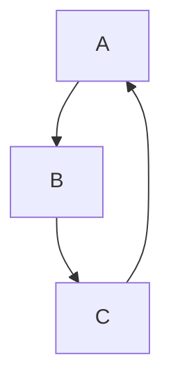

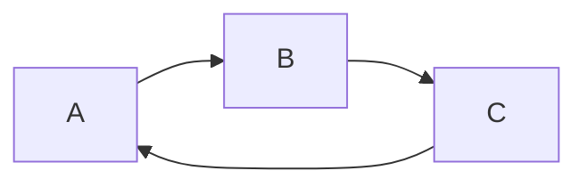

==id是名称，而不是固定的形式==

#### a.文字框

|    表述    |      说明      |                         含义                         |
| :--------: | :------------: | :--------------------------------------------------: |
|  id[文字]  |    矩形节点    |          表示过程，也就是整个流程的一个环节          |
|  id(文字)  |  圆角矩形节点  |                    表示开始和结束                    |
| id((文字)) |    圆形节点    | 表示连接，为避免流程过长或有交叉，可将流程切开，成对 |
|  id{文字}  |    菱形节点    |                    表示判断，决策                    |
|  id>文字]  | 右向旗帜状节点 |                                                      |

==我们可以根据包着文字的框框形状来判断，是什么节点==


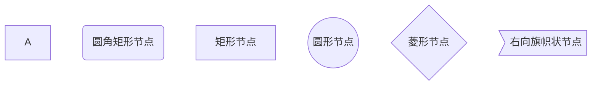

**example**  第二遍输入的话，直接打名字就ok了

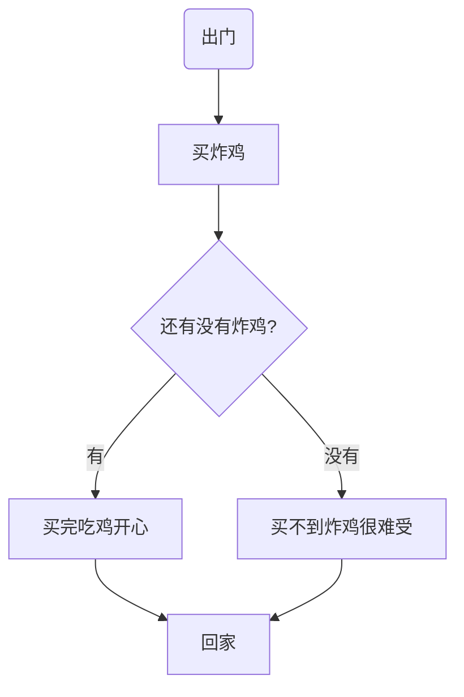

#### b.连线

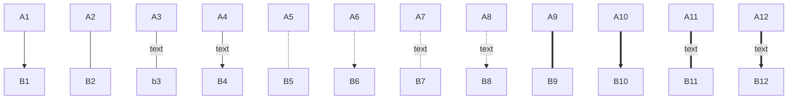

#### c.子图表(subgraph)

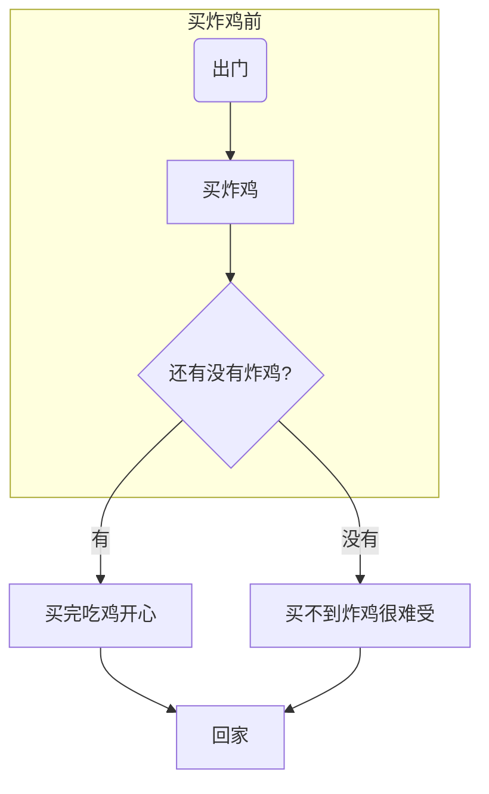

### 2.序列图(sequenceDiagram)

**这次是**`markdown`  **不是**`mermaid`

####a.参与者

`paticipant<参与者名称>`  即声明参与者

#### b.消息线

| 类型 |           描述           |
| :--: | :----------------------: |
|  ->  |       无箭头的实线       |
| -->  |       无箭头的虚线       |
| ->>  |       有箭头的实现       |
| -->> |       有箭头的虚线       |
|  -x  | 末端为叉的实线(表示异步) |
| --x  | 末端为叉的虚线(表示异步) |

#### c.处理中---激活框

> 在消息线末尾增加`+`,则消息接收者进入当前消息的"处理中"状态

> 在消息线末尾增加`-`,则消息接收者离开当前消息的"处理中"状态

#### d.注解

语法:Note 位置表示 参与者：标注文字

其中位置表述可以为

|   表述   |            含义            |
| :------: | :------------------------: |
| right of |            右端            |
| left of  |            左端            |
|   over   | 在当中，可以横跨多个参与者 |

```mermaid
sequenceDiagram
   participant 99 as 救救
   participant seller as 炸鸡店小哥
   Note over 99,seller : 热爱炸鸡
   Note left of 99 : 女
   Note right of seller :男
   99->>seller:还有炸鸡吗
   seller-->>99:没有要现炸
   99-x +seller :给我炸
   seller-->> -99:您的炸鸡好了！
```


#### e.循环(loop)

> 条件满足时，重复发出消息序列(相当于while)

```mermaid
sequenceDiagram
   participant 99 as 救救
   participant seller as 炸鸡店小哥
   Note over 99,seller : 热爱炸鸡
   Note left of 99 : 女
   Note right of seller :男
   99->>seller:还有炸鸡吗
   seller-->>99:没有要现炸
   99-x +seller :给我炸
   loop 三分钟一次
       99->>seller:我的炸鸡好了吗
       seller-->>99:正在炸
       end
   seller-->> -99:您的炸鸡好了！
```

#### f.选择(alt)

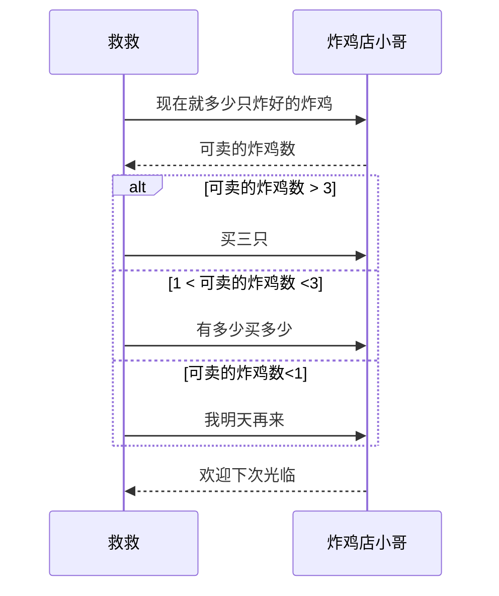

#### g.可选(opt)

**在某条件满足时执行的消息序列，否则不执行，相当于单个分支的if语句**

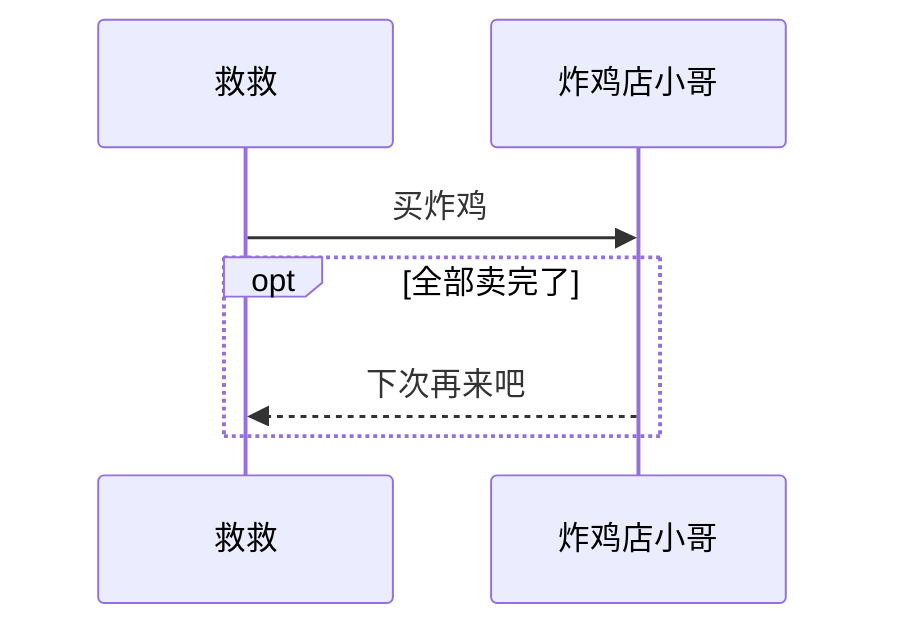

#### h.并行(par)

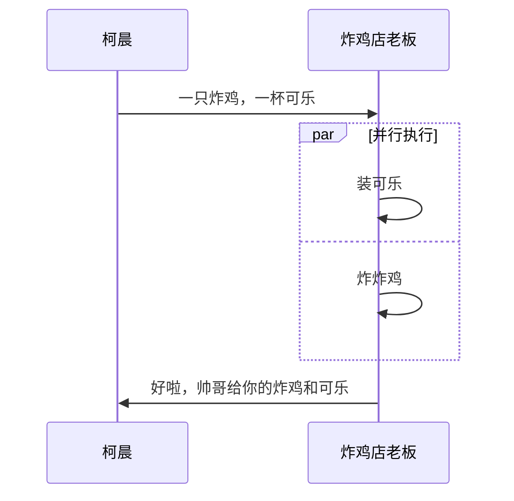


### 3.饼图(pie)

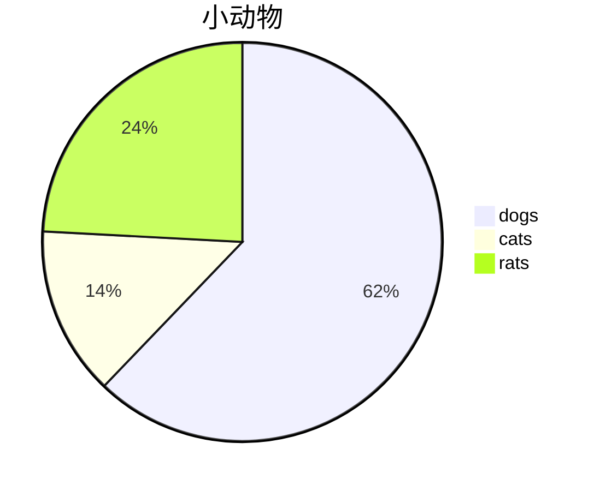

###4.甘特图(gantt)

done:已完成()

active:正在进行

crit:紧急的，重要的

> 五个参数//参数一：看是否紧急(crit),可不填

> 参数二：看是否是完成还是正在进行   done or active  可不填

>参数三：取小名，可不填

> 参数四：任务的开始时间（如果不填，会默认为上一个任务的结束时间为初始时间）

> 参数五，任务的结束时间 or 任务持续的时间

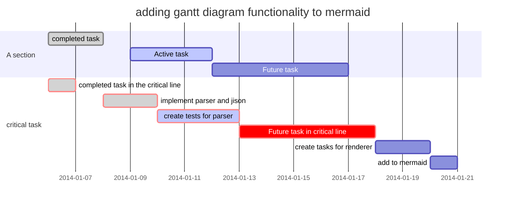

==下面这个甘特图是我自己打的==

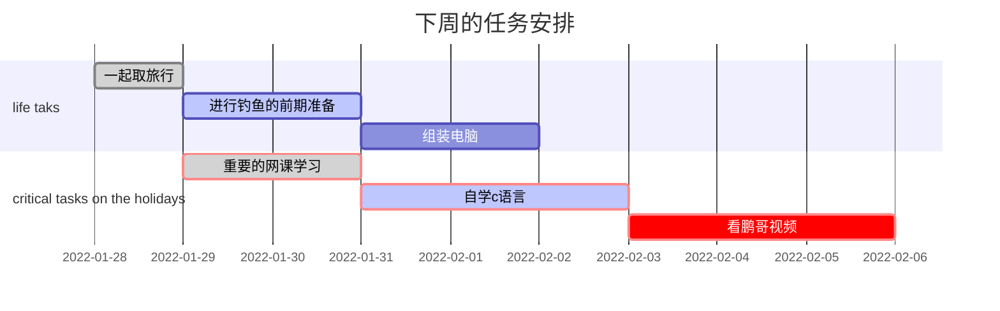

`mermaid`==官网gantt内容==

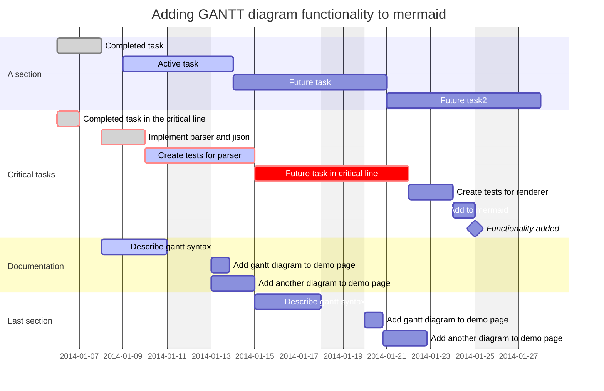


